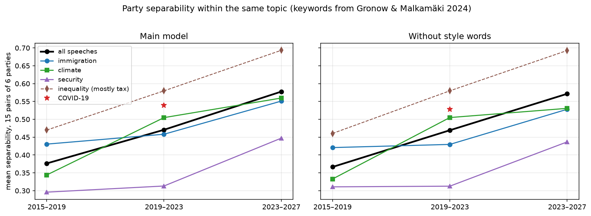

<!-- TODO: opening hook, 2–3 sentences. Draft: -->
Everyone has an opinion on whether Finnish politics is becoming more polarised.
We measured it: we taught a computer to guess which party a speaker belongs to
from a single plenary speech, and watched how much easier that guess has become
over three parliamentary terms.

## Parties have drifted apart — and the step came in 2023

```{python}
#| echo: false
#| label: fig-polarisation
#| fig-cap: "Mean separability over the 28 party pairs (0 = parties indistinguishable, 1 = always distinguishable). Bands: 10th–90th percentile over 8 repetitions. Random labels show the method finds no difference where none exists."
import pandas as pd
import plotly.graph_objects as go

s = pd.read_csv("../results/party_summary.csv")
fig = go.Figure()
for sarja, nimi, vari in [("real", "party labels", "#1f4e79"), ("random", "random labels", "#999999")]:
    t = s[s["series"] == sarja].groupby("term")["polarisation"].agg(
        mean="mean", lo=lambda x: x.quantile(0.1), hi=lambda x: x.quantile(0.9))
    fig.add_trace(go.Scatter(
        x=t.index, y=t["mean"], mode="lines+markers", name=nimi,
        line={"color": vari},
        error_y={"type": "data", "array": t["hi"] - t["mean"],
                 "arrayminus": t["mean"] - t["lo"]}))
fig.update_layout(margin={"t": 10, "b": 10}, yaxis_title="separability",
                  xaxis_title="parliamentary term", template="plotly_white")
fig.show()
```

<!-- TODO: 2–3 paragraphs on Finding 1: 0.39 → 0.45 → 0.56; the leave-out
cross-check; the rise is a step in 2023–27, not a steady trend; speech length
explains part of the first rise but not the second. -->

## It is not just that parties talk about different things

{#fig-topics}

<!-- TODO: Finding 2: separability rises within immigration, climate and
security; framing, not only issue ownership; comparison with the Twitter
study. -->

## Two blocs

{#fig-map}

<!-- TODO: Finding 3: NCP–Finns–CD speak alike in every term, also in
opposition; Left–SDP–Greens are close in positions but speak differently;
in 2023–27 the ideological divide and the government line coincide. -->

## How we measured this {.callout-note}

<!-- TODO: a short box: classifier + TF-IDF, grouped cross-validation,
balanced training, permutation baseline, leave-out cross-check
[@gentzkow2019; @simola2023]. Link to the technical report and the repo. -->

## Side notes

<!-- TODO: team decision on which notebook 90 items to include, e.g. the
interjection heat map, the word 'polarisaatio' tripling, the word of each
year, the all-night recovery-package sitting. -->

## What this does and does not show

<!-- TODO: limitations: three terms, three governments; language vs.
positions; CD and SPP uncertain; incomplete 2023–27 term. -->

---

*Data: Parliament of Finland open data (CC BY 4.0) and Yle election compasses
(CC BY 4.0), analysed at party level only. AI (Anthropic's Claude) was used for
research design, code, figures and text drafting; the team reviewed all output.
Code and methods: [github.com/jtompuri/data-science-mini-project](https://github.com/jtompuri/data-science-mini-project).*

## References

::: {#refs}
:::
