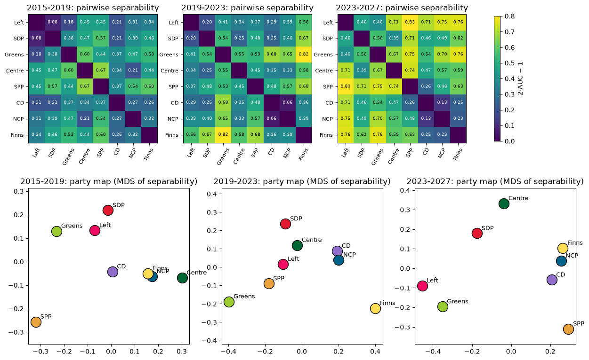

Everyone has an opinion on whether Finnish politics is becoming more polarised.
We measured it. We taught a computer to guess which party a speaker belongs to
from a single plenary speech — and watched how much easier that guess has
become over three parliamentary terms.

The model never sees names, party names or greetings, only the words of the
speech itself. In 2015–19 it picked the right party out of eight about once in
four attempts. In the current term it is right once in three. That may sound
modest, but most parliamentary speech is procedural prose that any party could
have delivered; the interesting part is the change.

## Parties have drifted apart — and the step came in 2023

Our headline measure is **separability**: how reliably two parties' speeches
can be told apart (0 = indistinguishable, 1 = always distinguishable).
Averaged over all 28 party pairs, it rose from 0.39 to 0.45 to 0.56 across the
three terms.

```{python}
#| echo: false
#| label: fig-polarisation
#| fig-cap: "Mean separability over the 28 party pairs (0 = parties indistinguishable, 1 = always distinguishable). Bands: 10th–90th percentile over 8 repetitions. Random labels show the method finds no difference where none exists."
import pandas as pd
import plotly.graph_objects as go

s = pd.read_csv("../results/party_summary.csv")
fig = go.Figure()
for sarja, nimi, vari in [("real", "party labels", "#1f4e79"), ("random", "random labels", "#999999")]:
    t = s[s["series"] == sarja].groupby("term")["polarisation"].agg(
        mean="mean", lo=lambda x: x.quantile(0.1), hi=lambda x: x.quantile(0.9))
    fig.add_trace(go.Scatter(
        x=t.index, y=t["mean"], mode="lines+markers", name=nimi,
        line={"color": vari},
        error_y={"type": "data", "array": t["hi"] - t["mean"],
                 "arrayminus": t["mean"] - t["lo"]}))
fig.update_layout(margin={"t": 10, "b": 10}, yaxis_title="separability",
                  xaxis_title="parliamentary term", template="plotly_white")
fig.show()
```

Two checks make us trust the shape of this curve. First, when we shuffle the
party labels and repeat everything, the measure drops to zero — the method
does not invent differences where none exist. Second, a completely different
measure from the economics literature, the leave-out estimator of
@gentzkow2019 that @simola2023 applied to a century of Finnish parliamentary
speech, ranks the party pairs almost identically.

That second measure can also be computed year by year, and it sharpens the
story: it is flat from 2015 through 2022 and rises from 2023 onwards. What
looks like a decade-long trend is closer to a **step change during the current
term**. Part of the earlier rise has a mundane explanation — speeches simply
got longer between the first two terms, and longer speeches are easier to
classify. The jump after 2023 remains after we control for speech length.

## It is not just that parties talk about different things

An obvious objection: perhaps parties have not changed how they speak, only
what they speak about. The Finns Party talks about immigration, the Greens
about climate, and a word counter will tell them apart without any
polarisation being involved.

So we repeated the measurement *inside* topics, using the topic keywords of a
recent study of Finnish social media [@gronow2024]: immigration, climate,
security and inequality. Within every one of them, parties have become easier
to tell apart — climate from 0.34 to 0.56, immigration from 0.42 to 0.55,
security from 0.30 to 0.45.

![Separability within the same topic. Parties increasingly speak differently about the same subject. [@gronow2024]](figures/res_polarisation_by_topic.png){#fig-topics}

Parties are not only choosing different subjects; they increasingly speak
about **the same subject in different ways**. The directions match the Twitter
study: the gap between the Finns Party and the left-green parties on climate
doubled in 2019–23, exactly when climate began to polarise on Finnish social
media. Part of the within-topic gap is institutional role — governments defend
bills and oppositions attack them in the same debate — which is why the next
finding matters.

## Two blocs

Which parties sound alike? The maps below place parties so that the ones the
model confuses most often sit closest together.

{#fig-map}

Three things stand out.

**The National Coalition, the Finns Party and the Christian Democrats sound
alike in every term** — including 2019–23, when all three were in opposition.
Their speech is more similar than their election-compass answers would
predict. Government status alone does not explain it: the five-party Marin
government spoke *less* cohesively than its three-party opposition.

**The Left Alliance, the SDP and the Greens are close in positions but not in
speech.** On the election compass they are among the closest pairs in
parliament, yet each of them speaks in its own register.

**In 2023–27 the two dividing lines coincide for the first time.** The
right-side bloc is now the core of the government, the left-green parties are
in opposition, and the pairs across that line have become the most separable
pairs in parliament (0.66 on average). This coincidence — an ideological bloc
structure lining up with the government–opposition divide — is what produces
the step change of the first figure.

::: {.callout-note}
## How we measured this

We trained a classifier (TF-IDF features and logistic regression) to predict
the speaker's party from a single speech, separately for each term and eight
parties, from about 130,000 plenary speeches (2015 – Sep 2026, Parliament of
Finland open data). Names, party names and formulaic phrases are removed
before training. The model is always tested on **speakers it never saw during
training**, every party gets the same amount of training data, and every
number is reported against a shuffled-labels baseline — the precautions that
@gentzkow2019 show are necessary before reading classifier accuracy as
polarisation. Separability of a party pair is 2·AUC − 1 on the model's
probabilities; our cross-check is the leave-out estimator used by
@simola2023. Full details, robustness checks and code:
[the technical report and repository](https://github.com/jtompuri/data-science-mini-project).
:::

## Side notes from the transcripts

<!-- TODO (team decision pending): final selection of notebook 90 items.
Drafts for the four proposed ones below - cut freely. -->

**The word "polarisaatio" has itself polarised the record.** Its stem appears
three times as often in the current term (22 occurrences per million words) as
in 2015–19 (8 per million) — and the number of different MPs using it has
grown at the same rate.

**Interjections have doubled**, from about 28 per hundred speeches in 2015–19
to 56 now. Their direction follows the blocs: left-green MPs heckle the
National Coalition and the Finns Party, and vice versa.

**Every year has its word.** The fastest-rising stems trace the decade:
*kiky* (2016), *aktiivimalli* (2017), *korona* (2020), *Ukraina* (2022),
*velkajarru* (2025).

**The longest night** belongs to the EU recovery package: the sitting of
12 May 2021 ended at 7.57 the next morning, and 99 % of the small-hours
speeches came from one party — the Finns Party.

## What this does and does not show

Three caveats belong in any honest reading. First, three terms means three
different governments: with these data, a time trend cannot be fully separated
from who happens to govern. Second, we measure **language, not opinions** —
though the speech distances do match election-compass distances in the two
most recent terms. Third, the smallest parties (the Christian Democrats and
the Swedish People's Party) have so few MPs that their numbers are noisy, and
the current term is still incomplete (data to September 2026). Unlike
@simola2023, we do not control for MPs' region or gender.

What the data do show is specific: a measurable, robust widening of the
linguistic distance between Finnish parties, concentrated in the current
term, visible within topics, and organised around two blocs whose boundary
now coincides with the government–opposition divide.

---

*Data: Parliament of Finland open data (CC BY 4.0) and Yle election compasses
(CC BY 4.0), analysed at party level only. AI (Anthropic's Claude) was used for
research design, code, figures and text drafting; the team reviewed all output.
Code and methods: [github.com/jtompuri/data-science-mini-project](https://github.com/jtompuri/data-science-mini-project).*

## References

::: {#refs}
:::
